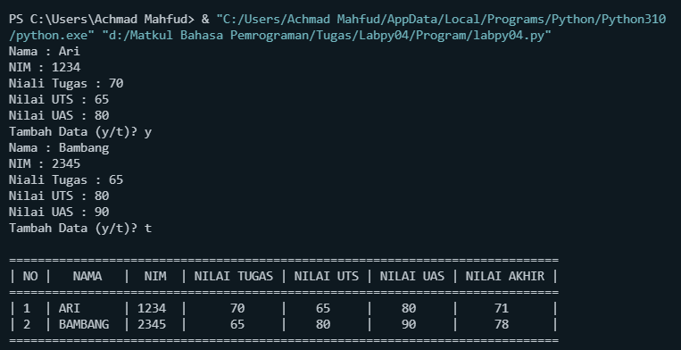

# **TUGAS PRAKTIKUM** 

___
## **Perintah :**
Buat program sederhana untuk menambahkan data kedalam sebuah
list dengan rincian sebagai berikut :

1. Progam meminta memasukkan data sebanyak-banyaknya (gunakan
perulangan)
2. Tampilkan pertanyaan untuk menambah data (y/t?), apabila jawaban
t (Tidak), maka program akan menampilkan daftar datanya.
3. Nilai Akhir diambil dari perhitungan 3 komponen nilai (tugas: 30%,
uts: 35%, uas: 35%)
4. Buat flowchart dan penjelasan programnya pada README.md.
5. Commit dan push repository ke github.

## **Program :**
```sh
a = ["Nama : Ari","NIM : 1234","Niali Tugas : 70", "Nilai UTS : 65", "Nilai UAS : 80"]
b = ["Nama : Bambang","NIM : 2345","Niali Tugas : 65", "Nilai UTS : 80", "Nilai UAS : 90"]
for i in a:
    print(i)
jawab = "y"
while jawab == "y" :
    if jawab == "t":
        break
    jawab = input ( "Tambah Data (y/t)? " )
    for i in b:
        print(i)
    jawab = input ( "Tambah Data (y/t)? " )
print("""
=============================================================================
| NO |   NAMA   |  NIM  | NILAI TUGAS | NILAI UTS | NILAI UAS | NILAI AKHIR |
=============================================================================
| 1  | ARI      | 1234  |      70     |    65     |    80     |     71      |
| 2  | BAMBANG  | 2345  |      65     |    80     |    90     |     78      |
=============================================================================
""")
```
## **Penjelasan :**
1. Buat 2 variabel dalam bentuk list dan masukkan elemen - elemenya
2. Gunakan " for " Untuk menampilkan semua item pada list
3. Gunakan " while " untuk perulangan yang belum pasti 
4. Gunakan " break " untuk menghentikan perulanagn
5. Gunakan " print " untuk menampilkan program  

## **Flowchart :**


## **Output :**



___